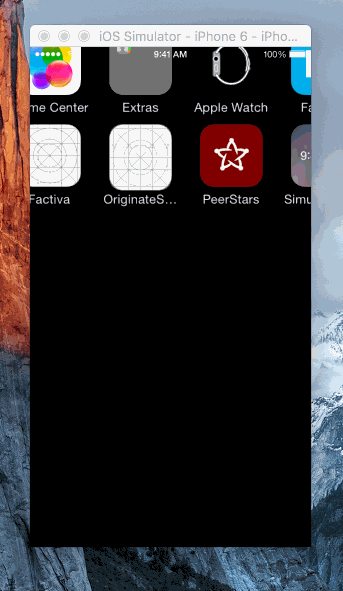

# OriginateScrollViewFloater

> A customizable `UIScrollView` floater element.





## Installation with CocoaPods

Add the following lines to your Podfile and then run `pod install`.

```ruby
source 'https://github.com/Originate/CocoaPods.git'
pod 'Originate+ScrollViewFloater'
```


## Usage

The floater element can be attached to any subclass of `UIScrollView`, including but not limited to `UITableView` and `UICollectionView`.


```objc
// Create the view to display.
// OriginateScrollViewFloaterDefaultView is a pre-made view you can use.
UIControl* floaterView =
    [[OriginateScrollViewFloaterDefaultView alloc] initWithTitle:@"OriginateScrollViewFloater!"
                                                            font:[UIFont systemFontOfSize:14]
                                                       textColor:[UIColor whiteColor]
                                                 backgroundColor:[UIColor blueColor]];


// Create the floater object.
self.floater = [[OriginateScrollViewFloater alloc] initWithScrollView:self.tableView
                                                          floaterView:floaterView];

// Add to view hierarchy (as sibling of scrollView).
[self.view addSubview:self.floater];
```


Displaying the floater in response to events is simple.

```objc
CGPoint offset = ... // desired offset of scrollView at which floater should appear

[self.floater showAtContentOffset:offset
                    fromDirection:OriginateScrollViewFloaterDirectionTop
              hideWhenApproaching:CGPointMake(0, 0)
                       tapHandler:^(void) {
                           [self scrollToTop];
                       }];
```